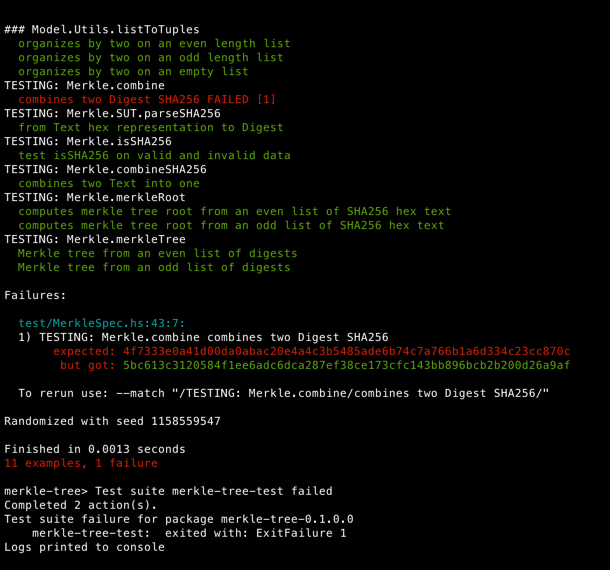

# merkle-tree

## Using Nix

### Nix

[Nix](https://nixos.org/) is a package manager that goes beyond traditional ones (like Apt, NPM, Brew, etc.) as it
allows:

* full reproducibility (the same input guarantee to give exactly the same output)
* "local" packages, meaning you don't need to install globally
* describe in a Nix file everything you need to build or run an application, and Nix configures everything locally:
    * language dependencies like JDK 14 or GHC 8.10.7
    * build systems like Maven or Stack
    * system dependencies like Zlib or PostgreSQL
    * environment variables
    * etc.

Below is a high-level explanation of the different Nix files.

### Run the project

There is no executable, only a test suite is available. To execute them, simply run:

```shell script
# First, you need to enter the nix-shell to get `stack` available
$ nix-shell
# Then you run the tests
[nix-shell:~/projects/merkle-tree]$ stack test
```

### Modifying tests

At the beginning of [MerkleSpec](test/MerkleSpec.hs) there are some `Text` which are the SHA256 hex representation of
poorly chose values:

```haskell
anyValidData :: Text
anyValidData = "c67579305b91024bf849d4769c3110fac3f2d18678f20364e8f8b961cfcc8758" --Hex representation of "anyValidData"

anyValidDataBis :: Text
anyValidDataBis = "63976e06e21e475d03e227a04223293eb300b682dff506f5abbf981505bef520" --Hex representation of "anyValidDataBis"

anyValidDataTer :: Text
anyValidDataTer = "b3981997f43c7c06b8840f222e5789503982954b21fcb1b78ad4c27a246f8597" --Hex representation of "anyValidDataTer"

anyValidDataQuater :: Text
anyValidDataQuater = "9cc3cdb9ae29e2c2ae606601fccd546c4b767e7a07d5f8353f40484b20067304" --Hex representation of "anyValidDataQuater"

anyValidDataQuinquies :: Text
anyValidDataQuinquies = "d17f257be7cab8937bb0c063456156fae4a90362a6a5774faf7f0eec63028450" --Hex representation of "anyValidDataQuinquies"
```

If you want to run the tests with different values, you can:

- Change the Hex value of these constants:

```haskell
anyValidData :: Text
anyValidData = "04fde3471765d709f60613c849bcc0726cd6d666fb871bc0acde28dbe227a1e8" --Hex representation of "myCustomData"
```

- Create new constants using new Hex value and use them in test suite:

```haskell
myCustomData :: Text
myCustomData = "04fde3471765d709f60613c849bcc0726cd6d666fb871bc0acde28dbe227a1e8" --Hex representation of "myCustomData"

myCustomDataBis :: Text
myCustomDataBis = "a379aac97a52d544f357599fa2b2d344291797f577f79bd1861d1e0b71c6a682" --Hex representation of "myCustomDataBis"

merkleSpec :: Spec
merkleSpec = do
  describe "TESTING: Merkle.combine" $
    it "combines two Digest SHA256" $ do
      let [digest1, digest2, mkr] =
            fromJust . parseSHA256
              <$> [ myCustomData,
                    myCustomDataBis, --anyValidDataBis
                    "4f7333e0a41d00da0abac20e4a4c3b5485ade6b74c7a766b1a6d334c23cc870c"
                  ]
      SUT.combine digest1 digest2 `shouldBe` mkr
```

Of course, if you don't change the `mkr` Hex value (`"4f7333e0a41d00da0abac20e4a4c3b5485ade6b74c7a766b1a6d334c23cc870c"`
in our example), the test will fail:
